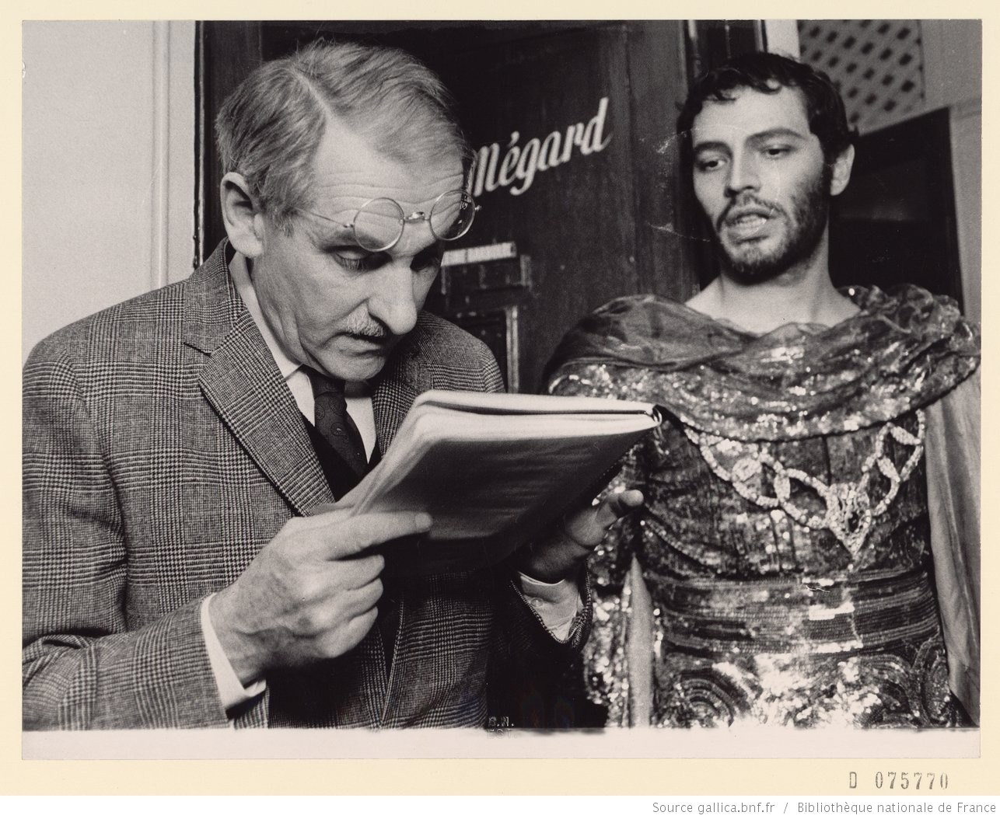

# Préambule

## 

## Objectifs

Dans le cadre d'un projet domotique lié à une pièce de théâtre réalisé par une classe de première ES de notre lycée, nous avons été consulté afin de concevoir un "pupitre" accompagné de plusieurs lumières qui s'allument et s'éteignent de façon aléatoire et d'une musique de fond.

**Ce projet est en vérité un sous-projet, en effet ce pupitre sera joint à d'autres projets tel qu'un ascenseur ou une application mobile capable d'orchestrer le pupitre et l'ascenseur.**

## l'Équipe

L'équipe en charge du pupitre est composé de quatre personne : Rached MEJRI, Hugo BESSARD, Lucas THOMAS et Methéo PIRAT. Chaque membre est en charge d'un périmètre spécifique en lien avec le pupitre.

## Date limite

Nous avons cinq séances de quatre heures afin de réaliser le projet.

**NOTE:** Le projet à été travaillé en dehors des heures scolaires, ainsi, la date limite fixé en fonction des séances n'est pas représentatif du travail fourni.

