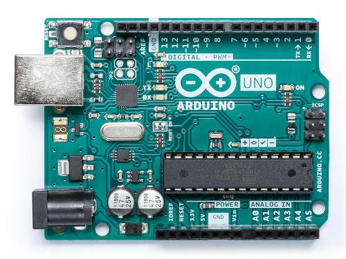

# L'environnement Arduino

[Arduino](https://fr.wikipedia.org/wiki/Arduino) est un microcontrôleur. Il est donc programmable et peut ainsi envoyer des "données" \(envoyer du courant afin d'allumer une [led](https://fr.wikipedia.org/wiki/Diode_électroluminescente) par exemple\) ou réceptionner des "données" \([réceptionner les données d'un capteur thermique ](https://www.carnetdumaker.net/articles/mesurer-une-temperature-avec-un-capteur-lm35-et-une-carte-arduino-genuino/)par exemple\).

| Alimentation | Documentation officiel | Le Language Reference |  |
| :--- | :--- | :--- | :--- |
| 5 Volt | [https://www.arduino.cc/en/main/docs](https://www.arduino.cc/en/main/docs) | [https://www.arduino.cc/reference/en/](https://www.arduino.cc/reference/en/) |  |

Sa simplicité en fait un choix idéal pour réaliser des projets concrets avec une limite de temps courte sans devoir se soucier des détails complexes.

