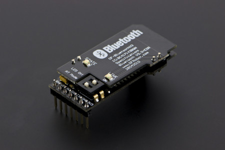
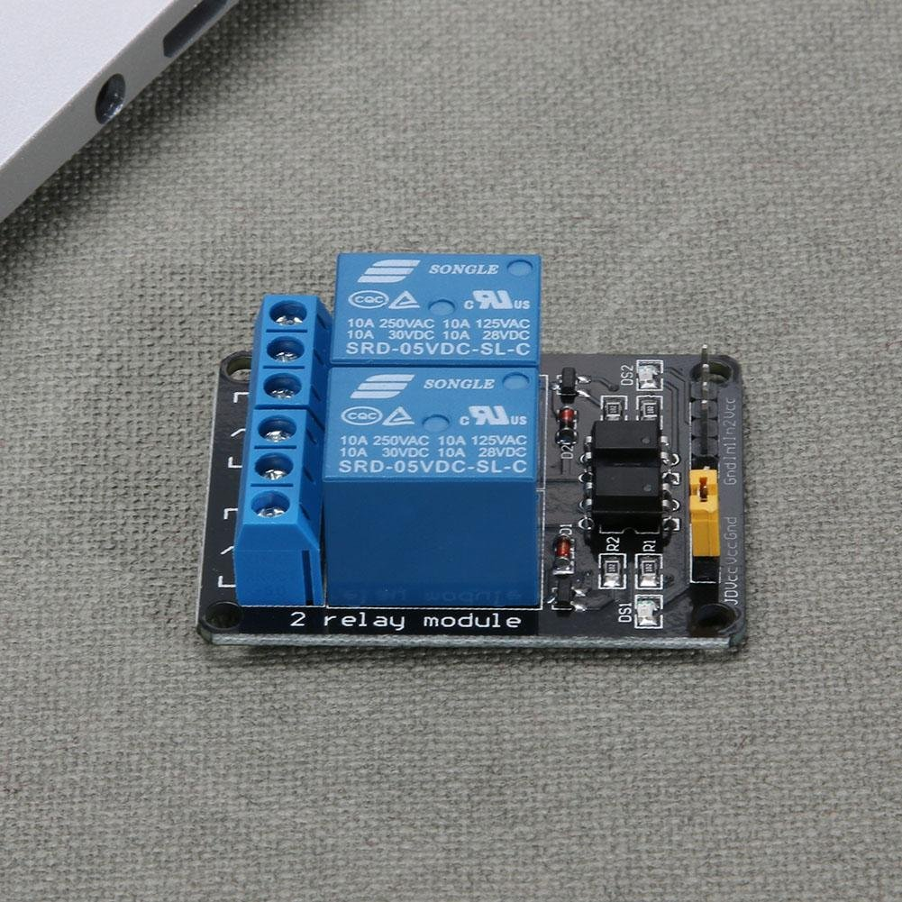

# Composants externes

## Le module bluetooth DF-BluetoothV3

### Description

Ce module Bluetooth permet d'ajouter une connexion série sans fil Bluetooth sur le microcontrôleur cible. Il communique avec ce dernier via un port série TTL.

### Tableau des caractéristiques 

| Alimentation | Bluetooth | Dimension | Datasheet |
| :--- | :--- | :--- | :--- |
| 3,5 à 8 Volt | Version 2.0 | 40 x 20 x 13 mm | [http://image.dfrobot.com/image/data/TEL0026/TEL0026\_Datasheet.pdf](http://image.dfrobot.com/image/data/TEL0026/TEL0026_Datasheet.pdf) |

### Emettre des informations au Raspberry PI

**IMPORTANT :** La broche TX du module doit être branché à la broche RX du Raspberry PI (PIN numéro 15 du Raspberry PI d'après la norme BCM) et la broche RX du module doit être branché à la broche TX du Raspberry PI (PIN numéro 14 du Raspberry PI d'après la norme BCM).

## Le relais Hillrong 12 V 

Ce relais possède en entrée une broche vers un PIN délivrant 3.3 Volt ou 0 Volt, une broche d'alimentation 5 Volt ou 3.3 Volt puis une broche de mise à la terre.

De l'autre côté, nous avons relié un câble partant du trou du milieu du relai vers la broche de haut-potentiel de la lumière puis nous avons relié de nouveau un câble partant du trou de droite du relai \(normalement ouvert\) vers l'alimentation délivrant du 16 Volt afin d'alimenter des lampes nécessitant une telle tension.

