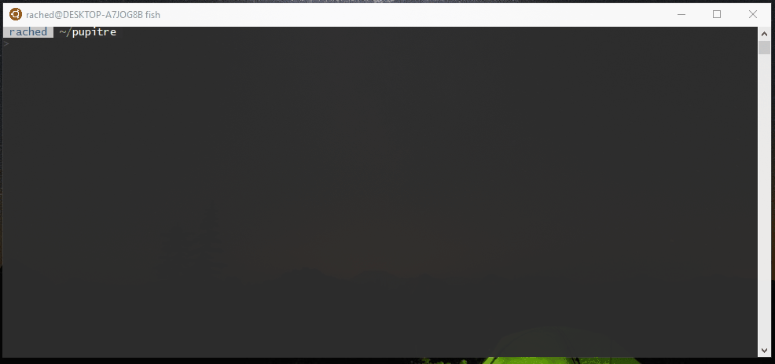

# OpenSSH et Makefile

## OpenSSH

 OpenSSH est un ensemble d'outils libres pour établir des communications chiffrés, donc sécurisées, sur un réseau informatique grâce au protocole SSH.

Nous avons par conséquent utilisé le programme `scp` afin de transférer des fichiers locaux du poste de travail vers le Raspberry PI ainsi que le protocole ssh afin d'accéder au terminal de se dernier à distance car le Raspberry PI ne possédait pas d'interface graphique.

## Makefile

Les Makefiles sont des fichiers, généralement appelés makefile ou Makefile, utilisés par le programme make pour exécuter un ensemble d'actions, comme la compilation d'un projet, l'archivage de document, la mise à jour de site et dans le cas présent le téléverser le projet stocké en local vers le Raspberry PI et le l’exécuter.

Nous avons jugé cette méthode comme étant la plus optimal car elle a la spécificité d'être native sur les systèmes UNIX-like tout en ayant une syntaxe relativement minimaliste.  

Voici ci-dessous le Makefile utilisé : 

```bash
push: 
    scp -r * pi@192.168.0.6:~/pupitre # l'adresse ip du raspberry peut changer d'un réseau local à un autre.
    ssh pi@192.168.0.6 python3 pupitre # On exécute le package Python du pupitre depuis le Raspberry PI
```

Nous pouvons donc exécuter les commandes écrites sur le Makefile grâce à cette commande depuis un shell Linux :

```bash
make push 
```

## Le cas de l'interface graphique sur le Raspberry PI

En effet, travailler directement sur le Raspberry PI aurait été une façon de gagner en efficacité. En revanche, il faut garder en tête que ce nano-ordinateur n'a pas la puissance d'un véritable ordinateur traditionnel. La mise en place d'une interface graphique aurait été donc dégradante pour les performances du système.

De plus, l'accès au terminal n'est pas un point faible. Il permet une certaine souplesse dans le contrôle du système que l'on ne retrouve dans une interface graphique.

## OpenSSH et Makefile par l'exemple 

Voici ci-dessous une vidéo au format gif qui montre l’exécution d'un Makfile afin d'automatiser nos opérations : 



